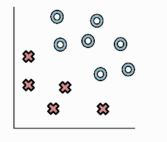
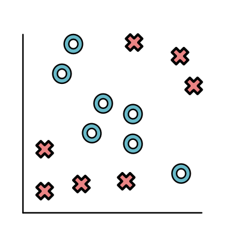
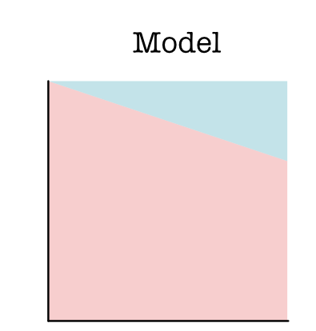
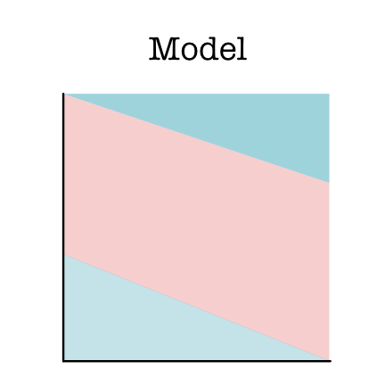
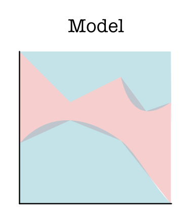
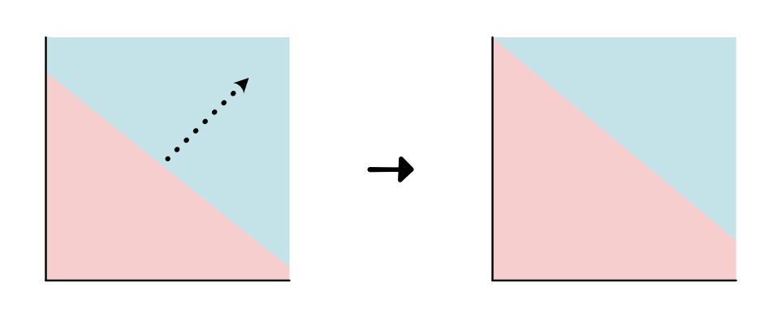
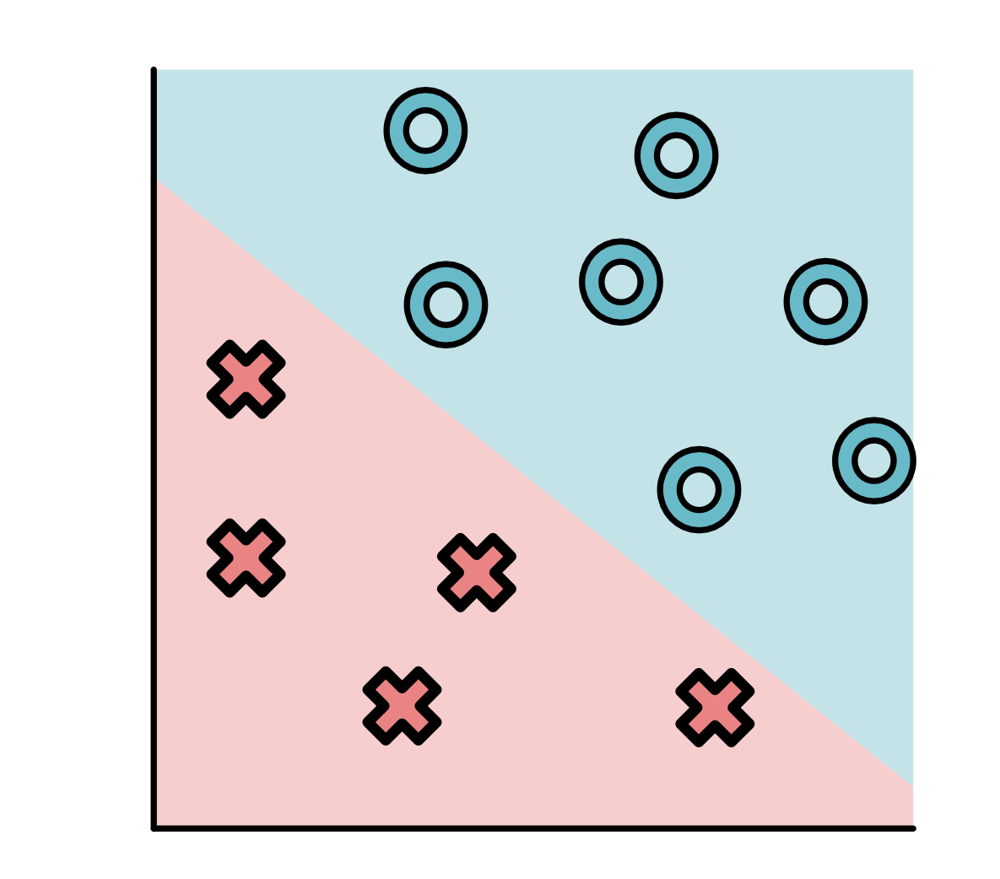

# Minitorch - ML PRIMER

En primer lugar verificaremos la correcta importacion del modulo minitorch en nuestro entorno virtual.


```python
import minitorch
```

Adicionalmente podemos corroborar con el comando show, la version y otros detalles del modulo.


```python
!pip show minitorch
```

    WARNING: The directory '/home/adr/.cache/pip' or its parent directory is not owned or is not writable by the current user. The cache has been disabled. Check the permissions and owner of that directory. If executing pip with sudo, you should use sudo's -H flag.
    Name: minitorch
    Version: 0.1
    Summary: UNKNOWN
    Home-page: UNKNOWN
    Author: None
    Author-email: None
    License: UNKNOWN
    Location: /home/adr/workspace/Module-0
    Requires: 
    Required-by: 


## 1. Conjunto de datos

Todos los puntos de un problema de aprendizaje supervisado cuentan con coordenadas (caracteristicas) y etiquetas (targets). Al graficar estos puntos la separacion entre ellos no es tan simple como se espera, en la mayoria de veces los datos se dispersan y encontrar una agrupación en base a sus coordenadas no es tan simple. Aqui podemos observar por ejemplo dos gráficos, el primero muy simple e ideal, el segundo representa un ejemplo mas cercano a la data que se afronta en el mundo real.


```python
from IPython.display import HTML, display
display(HTML("<table><tr><td></td><td></td></tr></table>"))
```


<table><tr><td></td><td></td></tr></table>


## 2. Modelo

Este componente es esencial para poder ajustar los datos y poder predecir futuras observaciones. Podríamos tomar como ejemplo un gráfico 2D donde las etiquetas que se asignan a los datos se determina mediante regiones, que establecen límites de decisión para cada cada etiqueta. Mostramos algunos ejemplos, a continuación:


```python
from IPython.display import HTML, display
display(HTML("<table><tr><td></td><td></td><td></td></tr></table>"))
```


<table><tr><td></td><td></td><td></td></tr></table>


## 3. Parámetros

Luego de decidir la clase de modelo mas adecuada para nuestros datos, debemos modificar o ajustar la clase de modelo elegido para llegar al modelo mas óptimo, estos ajustes son los llamados parámetros. Ejemplificamos esto con un gráfico 2D, donde la clase de modelo elegido es lineal. Los parametros de esta clase de modelo son la pendiente y el intercepto. En las siguientes imagenes se muestran estos ajustes hasta que se puedo llegar al mejor resultado (tercera imagen) que agrupe correctamente nuestras etiquetas.


```python
from IPython.display import HTML, display
display(HTML("<table><tr><td></td><td></td><td></td></tr></table>"))
```


<table><tr><td></td><td></td><td></td></tr></table>


## 4. Función de Perdida

Para la elección de un buen modelo debemos tener en cuenta la función de perdida, la cual se basará en la distancia y la dirección de la línea desde cada punto hasta el límite de decisión. Un buen modelo es el que hace que esta pérdida sea lo más pequeña posible. Se muestra en lineas negras la distancia de cada punto con su limite de decisión.


La pérdida se determina en función de esta distancia. La función más utilizada (y en la que nos centraremos) es la función sigmoidea. Para entradas fuertes negativas, va a cero, y para fuertes positivas, va a 1. En el medio, forma una curva en S suave.


Como se muestra a continuación, las pérdidas de tres puntos X aterrizan en las siguientes posiciones para la curva sigmoidea. Casi cero para el punto A, valor medio para el punto B y casi uno para el punto C.


Finalmente se elige el modelo que ofrezca la menor perdida.
